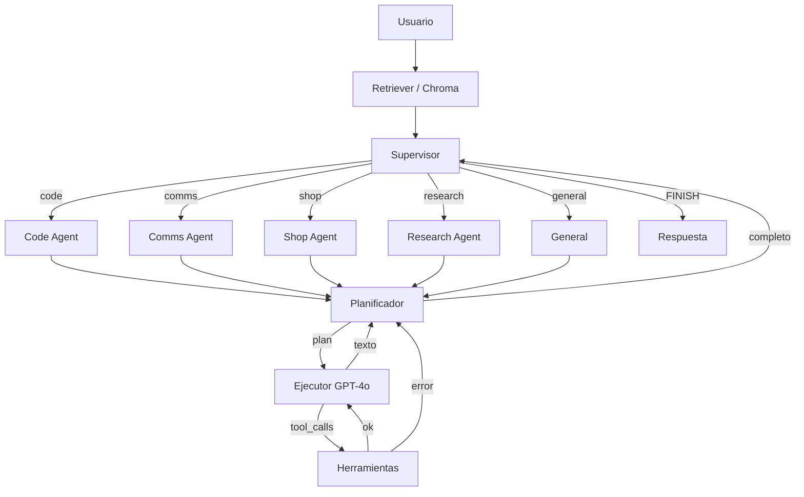

# Jarvis v2.0 — Arquitectura Multi-Agente

Sistema de agentes autónomos con **Supervisor LangGraph**: el router recibe el prompt, delega a un especialista (Code, Comms, Shop, Research o General) y espera el resultado.

## Stack

- **Orquestación:** LangGraph `StateGraph` (flujos cíclicos)
- **Planificación:** OpenAI o Anthropic (configurable; `o1` / Claude 3.5 Sonnet)
- **Ejecución / function calling:** GPT-4o
- **Memoria:** ChromaDB local (fallback in-memory)
- **API:** FastAPI asíncrono
- **WhatsApp:** puente local `whatsapp-web.js` (QR con tu número personal)
- **Voz:** Vapi (orquestación WebRTC + Custom LLM) y Cartesia Sonic (TTS de baja latencia)

## Estructura

```
jarvis/
  supervisor.py        # Router: decide, pasa contexto, espera reporte
  voice.py             # Frases hablables (sin Markdown) para TTS
  agents/
    code_agent.py
    comms_agent.py
    shop_agent.py
    research_agent.py
    general.py
  api/
    vapi_routes.py     # POST /webhooks/vapi-llm (OpenAI-compatible)
    app.py
  integrations/
    zadarma.py         # REST firmada (Key+Secret) + SMS PBX
    cartesia.py
whatsapp-bridge/       # Node: whatsapp-web.js + Express :3000
start_all.sh           # FastAPI :8000 + puente :3000
jarvis/db/             # SQLite bandeja MensajeEntrante
jarvis/tools/email_reader.py  # IMAP → bandeja
```

En el dashboard de Vapi: Custom LLM = `https://<host>/webhooks/vapi-llm` (Vapi añade `/chat/completions`). El JSON de partida está en `GET /voice/vapi-assistant`. El asistente guardado allí es la fuente de verdad del modelo, la voz y el prompt: con `VAPI_ASSISTANT_ID` configurado, el botón HABLAR del HUD arranca ese asistente por ID y sin overrides (`GET /voice/config` se lo pasa al navegador; no hay ningún ID escrito en el frontend). Sin ID, o si el del panel no arranca, el HUD monta un asistente efímero con el Custom LLM de este servidor.

## Arranque

Hace falta **dos procesos**: FastAPI en `:8000` y el puente WhatsApp en `:3000`.

```bash
python -m venv .venv
source .venv/bin/activate
pip install -r requirements.txt
cp .env.example .env   # añade OPENAI_API_KEY o ANTHROPIC_API_KEY
cd whatsapp-bridge && npm install && cd ..
chmod +x start_all.sh
./start_all.sh
```

O en terminales separadas:

```bash
# Terminal 1 — Supervisor
uvicorn jarvis.api.main:app --reload --port 8000

# Terminal 2 — WhatsApp Web (primera vez: escanea el QR)
cd whatsapp-bridge && npm start
```

`LocalAuth` guarda la sesión en `whatsapp-bridge/.wwebjs_auth/` (gitignored) para no volver a escanear el QR en cada reinicio.

Sin claves LLM el sistema entra en **modo offline**: router heurístico + herramientas reales (calculadora, sandbox, wrappers demo de Shopify/WhatsApp/Zadarma/OSINT). Si el puente Node no está levantado, `send_whatsapp_message` responde en modo demo.

El Research Agent usa `TAVILY_API_KEY` para búsqueda web (si falta, cae en DuckDuckGo) y `HUNTERIO_API_KEY` para el Domain Search de Hunter.io: sin esa clave, `find_public_emails` avisa en vez de inventar correos.

La búsqueda va por el SDK oficial `tavily-python` con `search_depth="advanced"`, que devuelve fragmentos reordenados por relevancia en lugar de un resumen de la página, y cada resultado llega con su `score` para que el Ejecutor sepa a qué fuente creer. `web_search` y `advanced_dork_search` aceptan `topic` (`general`, `news`, `finance`) y `time_range` (`day`, `week`, `month`, `year`). El `site` de `advanced_dork_search` viaja como filtro `include_domains`, no como operador `site:` dentro del texto: Tavily es búsqueda semántica y no interpreta ese operador, así que antes la restricción de dominio no filtraba nada. Si la API falla —clave caducada, cuota agotada— se registra un aviso `🔎 [TAVILY]` antes de caer a DuckDuckGo, para que un fallo de credenciales no se confunda con una búsqueda sin resultados.

```bash
python agent_core.py "¿Cuánto es 17 * 24?"
python -m jarvis "¿Qué productos hay en Shopify?"
pytest
```

## Grafo



Endpoints: `GET /` (HUD Neural Core), `POST /api/jarvis/directive`, `GET /api/jarvis/inbox-status`, `POST /api/jarvis/vapi-events`, `POST /webhooks/whatsapp-local`, `POST /invoke`, `POST /webhooks/vapi-llm`, `POST /webhooks/vapi-llm/chat/completions`. CORS: `allow_origins=["*"]`.

La Terminal del Supervisor del HUD imprime lo que se dice en la llamada de Vapi («Tú: …» / «JARVIS: …») a partir de `vapi.on("message")`: las transcripciones `final` del tipo `transcript` y, si el asistente del panel no las envía, el historial de `conversation-update` (`static/transcripts.js`, sin duplicar entre las dos vías). Vapi solo entrega al navegador los tipos marcados en **Advanced → Client Messages** del asistente; si alguien habla y no llega ninguna línea, la terminal lo dice al colgar y pide activar `transcript` (y `conversation-update`).

El Custom LLM de Vapi responde SSE al estilo OpenAI (`chat.completion.chunk` → `finish_reason: "stop"` → `data: [DONE]`). El turno se cuenta **en voz alta mientras ocurre**, con `astream_jarvis` (`graph.astream_events`, versión `v2`) leyendo los eventos del grafo en tiempo real. Callarse es lo único que Vapi no perdona: un comentario `: keep-alive` mantiene el socket abierto, pero no evita que la llamada se corte por silencio.

1. **Frase puente.** Si el grafo no ha dicho nada en `VAPI_FILLER_DELAY_SECONDS` (0,15 s por defecto), sale un delta con una frase corta al azar («Analizando la directiva…», «Accediendo a los sistemas…»). Vapi la pronuncia al instante, lo que regala dos o tres segundos de proceso. No se repite la del turno anterior de la misma llamada, y si el Supervisor contesta dentro de ese margen no se dice nada: una pregunta rápida no se alarga con relleno.
2. **Narración de herramientas.** Cuando arranca una herramienta lenta (Tavily, Hunter, Shopify) se dice qué está pasando: «Accediendo a la red global, maestro». El mapa vive en `jarvis.voice.TOOL_NARRATION`; las instantáneas (calculadora, hora) no aparecen ahí. La frase espera medio segundo antes de salir: si la herramienta contesta antes, no se dice nada, porque anunciar algo que ya terminó solo alarga la respuesta. Tampoco se repite una frase dentro del mismo turno, y hay un margen de 2 s entre narraciones, porque el `research_agent` encadena varias herramientas en menos de un segundo.
3. **Tokens del ejecutor.** Los eventos `on_chat_model_stream` del nodo `executor` se reexpiden tal cual, así que la voz empieza la respuesta antes de que el grafo cierre. Solo de ese nodo: el planificador y el enrutado devuelven JSON estructurado, que no se puede pronunciar. Requiere un modelo con `streaming=True` (así se construye el ejecutor); en modo offline simplemente no hay tokens. Un `TokenGate` retiene los primeros caracteres y descarta el stream si pinta a datos (`{`, `[`, ```` ``` ````, `<`) en vez de prosa. El planificador y el Supervisor se construyen con `disable_streaming=True`: dentro de `astream_events` LangChain pasa a stream cualquier `invoke`, y pedir `Plan`/`RouteDecision` por trozos es lo que hacía saltar el aviso `PydanticSerializationUnexpectedValue … field_name='parsed'` de `langchain-openai` y dejaba el JSON a medias si el stream se cortaba. En una sola petición no hay aviso ni trozos, y no se pierde nada porque esos tokens nunca se pronunciaban.
4. **Frase final.** La respuesta de `spoken_from_state` cierra el turno, pero solo la parte que no se haya dicho ya: el borrador del ejecutor suele ser la respuesta, así que repetirla entera sonaría a tartamudeo (`_unsaid_tail` busca el solapamiento). Siempre se cierra con `finish_reason: "stop"` y `data: [DONE]`.

Si el grafo se queda mudo más de `VAPI_IDLE_SPEECH_SECONDS` (9 s), sale una frase de espera («Sigo en ello, maestro…») en vez de un keep-alive silencioso. Con la voz activa, el presupuesto del turno puede ser largo: `VAPI_RESPONSE_TIMEOUT_SECONDS` son 75 s, por debajo del `timeoutSeconds` (90) que Vapi aplica al Custom LLM, para que una investigación larga acabe en lugar de tirarse a la basura a los 30 s. Si lo agota, se contesta una frase de espera y el turno tardío se descarta.

La personalidad (`JARVIS_PERSONA`) va como primer `SystemMessage` del planificador, del ejecutor y del enrutado. Tiene que estar en los tres: el texto que se pronuncia lo redactan el planificador y el ejecutor, así que un prompt solo en el Supervisor se queda en la decisión de routing y la voz sale sin tono.

El camino JSON (sin `stream`) sigue usando `arun_jarvis` (`graph.ainvoke`), nunca el event loop directo: LangGraph despacha los nodos síncronos a un hilo, así que los heartbeats siguen saliendo mientras el turno trabaja. Si algo falla dentro del grafo, el endpoint sigue devolviendo 200 con deltas válidos y Jarvis dice «Mis sistemas han fallado, maestro» en voz alta (la traza completa queda en el log del servidor), en vez de cortar el stream y dejar la llamada muda.

Antes de llegar ahí, el propio grafo absorbe sus fallos internos para que el turno termine hablando (`NEURAL_ERROR_REPLY`, «Ha ocurrido un error en mi red neuronal al buscar los datos, maestro»). La salida estructurada pasa por `invoke_structured`, que acepta el esquema o un dict y convierte `None`, JSON inválido o una excepción del proveedor en `StructuredOutputError`. Si es el enrutado quien falla, el Supervisor decide por palabras clave (`heuristic_route`, la misma ruta del modo offline); si es el planificador, cierra el turno con el borrador del ejecutor o con la frase amable; y si revienta el subgrafo entero de un especialista (`make_specialist_node`), el Supervisor recibe un reporte con `ok: false` y esa frase, no una excepción. En los logs se distinguen por el prefijo: `[PLANNER]`, `[SUPERVISOR]` y `[research_agent]` (o el especialista que sea) llevan la traza completa; «Mis sistemas han fallado» queda solo para lo que falle fuera del grafo.

Cada turno deja rastro en la consola (Render, Railway o local) para saber en qué eslabón se rompe la llamada:

| Marca | Significado |
| --- | --- |
| `🔥 [VAPI INCOMING]` | Llegó la petición: `call`, `stream` y el mensaje del usuario. Si no aparece, Vapi no está llamando a este servicio (revisa la URL del Custom LLM). Sale como `WARNING` con el payload completo cuando el JSON no trae ningún turno de usuario. |
| `🗣️ [VAPI FILLER]` | Frase puente o de espera que se dijo mientras el grafo trabajaba, y a qué segundo salió. Si nunca aparece, el grafo está contestando dentro del margen y no hace falta. |
| `🛰️ [VAPI NARRATION]` | Arrancó una herramienta lenta y se contó en voz alta. Si sale y luego hay un hueco largo hasta `OUTGOING`, ahí está la herramienta que se atasca. |
| `🧠 [VAPI SUPERVISOR]` | El grafo terminó: especialista elegido y herramientas usadas. |
| `✅ [VAPI OUTGOING]` | Frase que se manda a la voz, todo lo dicho antes de ella (`puente=`) y segundos que tardó el turno. |
| `⚠️ [VAPI TIMEOUT]` | El Supervisor pasó de `VAPI_RESPONSE_TIMEOUT_SECONDS`: se contesta la frase de espera. Si sale a menudo, sube el límite o revisa qué herramienta se atasca. |
| `💥 [VAPI ERROR]` | Fallo interno con traza completa; Vapi recibió la respuesta de error hablada. |
| `🔁 [CORE LOOP]` | El subgrafo de un especialista no cerró dentro del presupuesto de vueltas y se respondió con el mejor borrador disponible. |

El subgrafo Planificador → Ejecutor → Herramientas tiene un tope de vueltas (`JARVIS_MAX_ITERATIONS`, siempre por debajo de `JARVIS_RECURSION_LIMIT`): si el planificador no cierra, el turno responde con el último borrador en vez de morir con `GraphRecursionError` y dejar a Vapi diciendo «Error interno del sistema».

## Producción (Railway / Render)

```bash
# Procfile / Railway / Render
uvicorn jarvis.api.main:app --host 0.0.0.0 --port $PORT
# alternativa con Gunicorn
gunicorn -k uvicorn.workers.UvicornWorker -b 0.0.0.0:$PORT jarvis.api.main:app
```

Archivos de despliegue: `Dockerfile`, `.dockerignore`, `Procfile`, `railway.json`, `render.yaml`. Configura las claves de `.env.example` en el panel del proveedor (nunca en la imagen). Healthcheck: `GET /health`.
