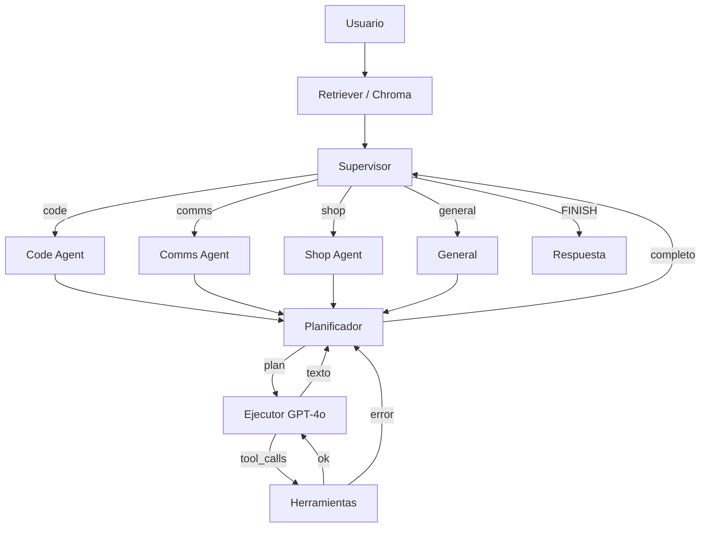

# Jarvis v2.0 — Arquitectura Multi-Agente

Sistema de agentes autónomos con **Supervisor LangGraph**: el router recibe el prompt, delega a un especialista (Code, Comms, Shop o General) y espera el resultado.

## Stack

- **Orquestación:** LangGraph `StateGraph` (flujos cíclicos)
- **Planificación:** OpenAI o Anthropic (configurable; `o1` / Claude 3.5 Sonnet)
- **Ejecución / function calling:** GPT-4o
- **Memoria:** ChromaDB local (fallback in-memory)
- **API:** FastAPI asíncrono
- **Frontend/Voz:** Fase 2 (Next.js + Vapi). Esta fase incluye un playground mínimo en `/`

## Estructura

```
agent_core.py          # CLI del grafo Planificador → Ejecutor → Tools
tools.py               # Re-export de herramientas Pydantic
jarvis/
  agent_core.py        # Nodos retrieve / planner / executor / tools
  supervisor.py        # Patrón Supervisor + handoff Command
  tools.py             # Core, code, comms, shop
  memory.py            # Retriever Chroma / in-memory
  api/                 # FastAPI + webhooks WhatsApp / Twilio
  integrations/        # Shopify GraphQL, WhatsApp, Twilio
tests/
```

## Arranque

```bash
python -m venv .venv
source .venv/bin/activate
pip install -r requirements.txt
cp .env.example .env   # añade OPENAI_API_KEY o ANTHROPIC_API_KEY
uvicorn jarvis.api.main:app --reload --port 8000
```

Sin claves API el sistema entra en **modo offline**: router heurístico + herramientas reales (calculadora, sandbox, wrappers demo de Shopify/WhatsApp/Twilio).

```bash
python agent_core.py "¿Cuánto es 17 * 24?"
python -m jarvis "¿Qué productos hay en Shopify?"
pytest
```

## Grafo



Endpoints: `GET /health`, `POST /invoke`, `GET /graph`, `GET|POST /webhooks/whatsapp`, `POST /webhooks/twilio`.
