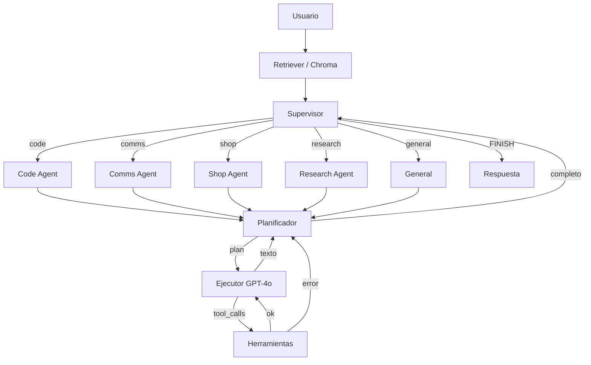

# Jarvis v2.0 — Arquitectura Multi-Agente

Sistema de agentes autónomos con **Supervisor LangGraph**: el router recibe el prompt, delega a un especialista (Code, Comms, Shop, Research o General) y espera el resultado.

## Stack

- **Orquestación:** LangGraph `StateGraph` (flujos cíclicos)
- **Planificación:** OpenAI o Anthropic (configurable; `o1` / Claude 3.5 Sonnet)
- **Ejecución / function calling:** GPT-4o
- **Memoria:** ChromaDB local (fallback in-memory)
- **API:** FastAPI asíncrono
- **WhatsApp:** puente local `whatsapp-web.js` (QR con tu número personal)
- **Voz:** Vapi (orquestación WebRTC + Custom LLM) y Cartesia Sonic (TTS de baja latencia)

## Estructura

```
jarvis/
  supervisor.py        # Router: decide, pasa contexto, espera reporte
  voice.py             # Frases hablables (sin Markdown) para TTS
  agents/
    code_agent.py
    comms_agent.py
    shop_agent.py
    research_agent.py
    general.py
  api/
    vapi_routes.py     # POST /webhooks/vapi-llm (OpenAI-compatible)
    app.py
  integrations/
    zadarma.py         # REST firmada (Key+Secret) + SMS PBX
    cartesia.py
whatsapp-bridge/       # Node: whatsapp-web.js + Express :3000
start_all.sh           # FastAPI :8000 + puente :3000
jarvis/db/             # SQLite bandeja MensajeEntrante
jarvis/tools/email_reader.py  # IMAP → bandeja
```

En el dashboard de Vapi: Custom LLM = `https://<host>/webhooks/vapi-llm` (Vapi añade `/chat/completions`). Voz = Cartesia. El JSON listo está en `GET /voice/vapi-assistant`.

## Arranque

Hace falta **dos procesos**: FastAPI en `:8000` y el puente WhatsApp en `:3000`.

```bash
python -m venv .venv
source .venv/bin/activate
pip install -r requirements.txt
cp .env.example .env   # añade OPENAI_API_KEY o ANTHROPIC_API_KEY
cd whatsapp-bridge && npm install && cd ..
chmod +x start_all.sh
./start_all.sh
```

O en terminales separadas:

```bash
# Terminal 1 — Supervisor
uvicorn jarvis.api.main:app --reload --port 8000

# Terminal 2 — WhatsApp Web (primera vez: escanea el QR)
cd whatsapp-bridge && npm start
```

`LocalAuth` guarda la sesión en `whatsapp-bridge/.wwebjs_auth/` (gitignored) para no volver a escanear el QR en cada reinicio.

Sin claves LLM el sistema entra en **modo offline**: router heurístico + herramientas reales (calculadora, sandbox, wrappers demo de Shopify/WhatsApp/Zadarma/OSINT). Si el puente Node no está levantado, `send_whatsapp_message` responde en modo demo.

El Research Agent usa `TAVILY_API_KEY` para búsqueda web (si falta, cae en DuckDuckGo) y `HUNTERIO_API_KEY` para el Domain Search de Hunter.io: sin esa clave, `find_public_emails` avisa en vez de inventar correos.

```bash
python agent_core.py "¿Cuánto es 17 * 24?"
python -m jarvis "¿Qué productos hay en Shopify?"
pytest
```

## Grafo



Endpoints: `GET /` (HUD Neural Core), `POST /api/jarvis/directive`, `GET /api/jarvis/inbox-status`, `POST /api/jarvis/vapi-events`, `POST /webhooks/whatsapp-local`, `POST /invoke`, `POST /webhooks/vapi-llm`, `POST /webhooks/vapi-llm/chat/completions`. CORS: `allow_origins=["*"]`.

El Custom LLM de Vapi responde SSE al estilo OpenAI (`chat.completion.chunk` → `finish_reason: "stop"` → `data: [DONE]`). Mientras LangGraph piensa, el stream manda comentarios `: keep-alive` y, si el Supervisor pasa de `VAPI_RESPONSE_TIMEOUT_SECONDS` (30 s por defecto), contesta una frase de espera en vez de dejar la petición colgada: así Vapi nunca cierra con «Assistant Did Not Receive Response».

El stream va en dos fases para que la llamada no se quede muda mientras las herramientas trabajan:

1. **Frase puente.** El grafo arranca al recibir la petición y, si no ha contestado en `VAPI_FILLER_DELAY_SECONDS` (0,15 s por defecto), sale un delta con una frase corta al azar («Analizando la directiva…», «Accediendo a los sistemas…»). Vapi la pronuncia al instante, lo que regala dos o tres segundos de proceso. No se repite la frase del turno anterior de la misma llamada, y si el Supervisor contesta dentro de ese margen no se dice nada: una pregunta rápida no se alarga con relleno.
2. **Respuesta real.** Al terminar el grafo se manda la frase hablable en deltas, separada de la frase puente por un espacio, y se cierra con `finish_reason: "stop"` y `data: [DONE]`.

Los deltas llevan la frase ya compuesta por `spoken_from_state`, no los tokens crudos del modelo: esa frase necesita el estado final del grafo (resultados de herramientas incluidos), y hacer stream token a token del LLM le haría leer en voz alta JSON de herramientas y borradores intermedios.

El Supervisor se invoca con `arun_jarvis` (`graph.ainvoke`), nunca desde el event loop: LangGraph despacha los nodos síncronos a un hilo, así que los heartbeats siguen saliendo mientras el turno trabaja. Si algo falla dentro del grafo, el endpoint sigue devolviendo 200 con deltas válidos y Jarvis dice «Maestro, ha habido un fallo en la red neuronal» en voz alta (la traza completa queda en el log del servidor), en vez de cortar el stream y dejar la llamada muda.

Cada turno deja rastro en la consola (Render, Railway o local) para saber en qué eslabón se rompe la llamada:

| Marca | Significado |
| --- | --- |
| `🔥 [VAPI INCOMING]` | Llegó la petición: `call`, `stream` y el mensaje del usuario. Si no aparece, Vapi no está llamando a este servicio (revisa la URL del Custom LLM). Sale como `WARNING` con el payload completo cuando el JSON no trae ningún turno de usuario. |
| `🗣️ [VAPI FILLER]` | Frase puente que se dijo mientras el grafo trabajaba, y a qué segundo salió. Si nunca aparece, el grafo está contestando dentro del margen y no hace falta. |
| `🧠 [VAPI SUPERVISOR]` | El grafo terminó: especialista elegido y herramientas usadas. |
| `✅ [VAPI OUTGOING]` | Frase que se manda a la voz, frase puente usada (`puente=`) y segundos que tardó el turno. |
| `⚠️ [VAPI TIMEOUT]` | El Supervisor pasó de `VAPI_RESPONSE_TIMEOUT_SECONDS`: se contesta la frase de espera. Si sale a menudo, sube el límite o revisa qué herramienta se atasca. |
| `💥 [VAPI ERROR]` | Fallo interno con traza completa; Vapi recibió la respuesta de error hablada. |
| `🔁 [CORE LOOP]` | El subgrafo de un especialista no cerró dentro del presupuesto de vueltas y se respondió con el mejor borrador disponible. |

El subgrafo Planificador → Ejecutor → Herramientas tiene un tope de vueltas (`JARVIS_MAX_ITERATIONS`, siempre por debajo de `JARVIS_RECURSION_LIMIT`): si el planificador no cierra, el turno responde con el último borrador en vez de morir con `GraphRecursionError` y dejar a Vapi diciendo «Error interno del sistema».

## Producción (Railway / Render)

```bash
# Procfile / Railway / Render
uvicorn jarvis.api.main:app --host 0.0.0.0 --port $PORT
# alternativa con Gunicorn
gunicorn -k uvicorn.workers.UvicornWorker -b 0.0.0.0:$PORT jarvis.api.main:app
```

Archivos de despliegue: `Dockerfile`, `.dockerignore`, `Procfile`, `railway.json`, `render.yaml`. Configura las claves de `.env.example` en el panel del proveedor (nunca en la imagen). Healthcheck: `GET /health`.
