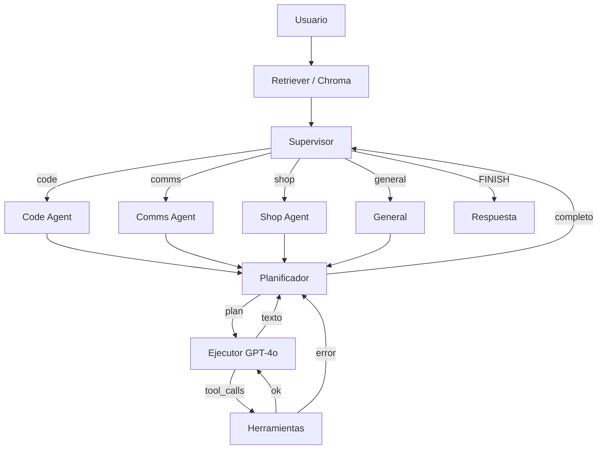

# Jarvis v2.0 — Arquitectura Multi-Agente

Sistema de agentes autónomos con **Supervisor LangGraph**: el router recibe el prompt, delega a un especialista (Code, Comms, Shop o General) y espera el resultado.

## Stack

- **Orquestación:** LangGraph `StateGraph` (flujos cíclicos)
- **Planificación:** OpenAI o Anthropic (configurable; `o1` / Claude 3.5 Sonnet)
- **Ejecución / function calling:** GPT-4o
- **Memoria:** ChromaDB local (fallback in-memory)
- **API:** FastAPI asíncrono
- **WhatsApp:** puente local `whatsapp-web.js` (QR con tu número personal)
- **Voz:** Vapi (orquestación WebRTC + Custom LLM) y Cartesia Sonic (TTS de baja latencia)

## Estructura

```
jarvis/
  supervisor.py        # Router: decide, pasa contexto, espera reporte
  voice.py             # Frases hablables (sin Markdown) para TTS
  agents/
    code_agent.py
    comms_agent.py
    shop_agent.py
    general.py
  api/
    vapi_routes.py     # POST /webhooks/vapi-llm (OpenAI-compatible)
    app.py
  integrations/
    zadarma.py         # REST firmada (Key+Secret) + SMS PBX
    cartesia.py
whatsapp-bridge/       # Node: whatsapp-web.js + Express :3000
start_all.sh           # FastAPI :8000 + puente :3000
jarvis/db/             # SQLite bandeja MensajeEntrante
jarvis/tools/email_reader.py  # IMAP → bandeja
```

En el dashboard de Vapi: Custom LLM = `https://<host>/webhooks/vapi-llm`, voz = Cartesia. El JSON listo está en `GET /voice/vapi-assistant`.

## Arranque

Hace falta **dos procesos**: FastAPI en `:8000` y el puente WhatsApp en `:3000`.

```bash
python -m venv .venv
source .venv/bin/activate
pip install -r requirements.txt
cp .env.example .env   # añade OPENAI_API_KEY o ANTHROPIC_API_KEY
cd whatsapp-bridge && npm install && cd ..
chmod +x start_all.sh
./start_all.sh
```

O en terminales separadas:

```bash
# Terminal 1 — Supervisor
uvicorn jarvis.api.main:app --reload --port 8000

# Terminal 2 — WhatsApp Web (primera vez: escanea el QR)
cd whatsapp-bridge && npm start
```

`LocalAuth` guarda la sesión en `whatsapp-bridge/.wwebjs_auth/` (gitignored) para no volver a escanear el QR en cada reinicio.

Sin claves LLM el sistema entra en **modo offline**: router heurístico + herramientas reales (calculadora, sandbox, wrappers demo de Shopify/WhatsApp/Zadarma). Si el puente Node no está levantado, `send_whatsapp_message` responde en modo demo.

```bash
python agent_core.py "¿Cuánto es 17 * 24?"
python -m jarvis "¿Qué productos hay en Shopify?"
pytest
```

## Grafo



Endpoints: `GET /` (HUD Neural Core), `POST /api/jarvis/directive`, `GET /api/jarvis/inbox-status`, `POST /api/jarvis/vapi-events`, `POST /webhooks/whatsapp-local`, `POST /invoke`, `POST /webhooks/vapi-llm`. CORS: `allow_origins=["*"]`.

## Producción (Railway / Render)

```bash
# Procfile / Railway / Render
uvicorn jarvis.api.main:app --host 0.0.0.0 --port $PORT
# alternativa con Gunicorn
gunicorn -k uvicorn.workers.UvicornWorker -b 0.0.0.0:$PORT jarvis.api.main:app
```

Archivos de despliegue: `Dockerfile`, `.dockerignore`, `Procfile`, `railway.json`, `render.yaml`. Configura las claves de `.env.example` en el panel del proveedor (nunca en la imagen). Healthcheck: `GET /health`.
